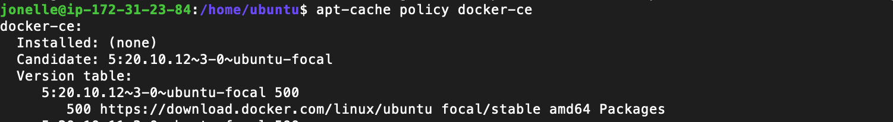
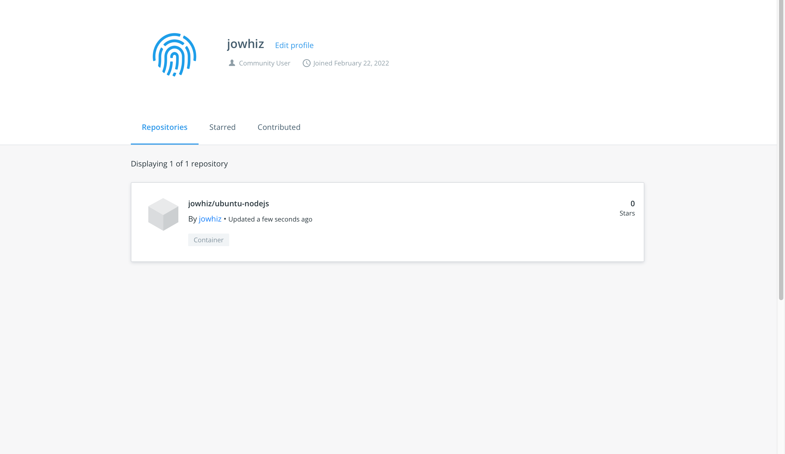

# Deploy-Matomo-Web-Analytics-on-Cloud
Project 3

`OBJECTIVES`

## By the end of this project:

* You will know how to install Matomo and a MariaDB database using Docker Compose;
* You will know how to install Nginx to act as a reverse proxy for the Matomo app;
* And, you will be able to enable secure HTTPS connections by using Certbot to download and configure SSL certificates from the Let’s Encrypt Certificate Authority.

### Before we get started, let’s get a quick understanding of what Matomo is, as well as other tools that were not  discussed in the earlier projects.

**Matomo** is an open-source, privacy respecting, self-hosted alternative to Google Analytics, written in PHP.

**Maria DB** is a drop-in replacement for the MySQL databases. It is one of the most popular open source relational databases. It’s made by the original developers of MySQL and guaranteed to stay open source. It is part of most cloud offerings and the default in most Linux distributions.
It is built upon the values of performance, stability, and openness, and MariaDB Foundation ensures contributions will be accepted on technical merit. https://mariadb.org

**Docker Compose** is a tool for defining and running multi-container Docker applications; It, also, uses YAML file to configure application services, using a single command to build, start, and stop containers.

**Certbot** https://certbot.eff.org


## 1. An Ubuntu 20.04 server, with the UFW firewall enabled.

Since we have previously discussed how to log into your AWS account from the ROOT user in projects 1 and 2, and how to launch an EC2 instance with Ubuntu 20.04 server, I will provide you with a link to a Youtube video that will quickly walk you through the steps.

https://www.youtube.com/watch?v=jpOM7UC_p8I" 

<video src="https://www.youtube.com/watch?v=jpOM7UC_p8I" autoplay controls> play 

`This video will also explain how to link your public IP to an Elastic IP. If you plan on stopping and restarting your instance, at is important to link it to an Elastic IP.`


### Step 1 — Logging in as root

If you are not already connected to your server, log in now as the **root** user using the following command (substitute the highlighted portion of the command with your server’s public IP address):

```bash
$ sudo su
```

Accept the warning about host authenticity if it appears. If you are using password authentication, provide your **root** password to log in. If you are using an SSH key that is passphrase protected, you may be prompted to enter the passphrase the first time you use the key each session. If this is your first time logging into the server with a password, you may also be prompted to change the **root** password.

The **root** user is the administrative user in a Linux environment that has very broad privileges. Because of the heightened privileges of the **root** account, you are *discouraged* from using it on a regular basis. This is because the **root** account is able to make very destructive changes, even by accident. 

The next step is setting up a new user account with reduced privileges for day-to-day use. Later, we’ll show you how to temporarily gain increased privileges for the times when you need them.

I have attached a visual aid that illustrates how to connect to the root user, using the `sudo su` command.

 https://www.youtube.com/watch?v=K1wr4Iugcio

 ### Step 2 — Creating a New User
 Now that you have logged in as the **root** user, you will need to add a user. 

 You can choose which ever name suites you. I used my first name to keep it simple. We will use this new user to log-in/ssh into this account instead of using the **root** user. 

 This example creates a new user called **name**, but you should replace that with a username of your choice:

```bash
# adduser name
```

You will be asked a few questions, starting with the account password.

Enter a strong password and, optionally, fill in any of the additional information if you would like. This is not required and you can just hit `ENTER` in any field you wish to skip.

### Step 3 — Granting Administrative Privileges

Now we have a new user account with regular account privileges. However, we may sometimes need to do administrative tasks.

To avoid having to log out of our normal user and log back in as the **root** account, we can set up what is known as *superuser* or **root** privileges for our normal account. This will allow our normal user to run commands with administrative privileges by putting the word `sudo` before the command.

To add these privileges to our new user, we need to add the user to the **sudo** group. By default, on Ubuntu 20.04, users who are members of the **sudo** group are allowed to use the `sudo` command.

As **root**, run this command to add your new user to the **sudo** group (substitute the highlighted username with your new user):

```bash
usermod -aG sudo name
```

Now, when logged in as your regular user, you can type `sudo` before commands to run them with superuser privileges.

### Step 4 — Setting Up a Basic Firewall

Ubuntu 20.04 servers can use the UFW firewall to make sure only connections to certain services are allowed. We can set up a basic firewall using this application.

Applications can register their profiles with UFW upon installation. These profiles allow UFW to manage these applications by name. OpenSSH, the service allowing us to connect to our server now, has a profile registered with UFW.

You can see this by typing:

```bash
# ufw app list
```
```bash
Output
Available applications:
  OpenSSH
```

We need to make sure that the firewall allows SSH connections so that we can log back in next time. We can allow these connections by typing:

```bash
# ufw allow OpenSSH
```

Afterwards, we can enable the firewall by typing:

```bash
# ufw enable
```

Type `y`and press `ENTER`to proceed. You can see that SSH connections are still allowed by typing:

```bash
# ufw status
```
As **the firewall is currently blocking all connections except for SSH**, if you install and configure additional services, you will need to adjust the firewall settings to allow traffic in.


## ****How to Set Up SSH Keys on your PC****

SSH, or secure shell, is an encrypted protocol used to administer and communicate with servers. When working with an Ubuntu server, chances are you will spend most of your time in a terminal session connected to your server through SSH.

we’ll focus on setting up SSH keys for an Ubuntu 20.04 installation. SSH keys provide a secure way of logging into your server and are recommended for all users.

### Step 1 — Creating the Key Pair


### Step 2 — Copying the Public Key to Your Ubuntu Server

The quickest way to copy your public key to the Ubuntu host is to use a utility called `ssh-copy-id`. Due to its simplicity, this method is highly recommended if available. If you do not have `ssh-copy-id` available to you on your client machine, you may use one of the two alternate methods provided in this section (copying via password-based SSH, or manually copying the key).

**Copying the Public Key Using `ssh-copy-id`**

The `ssh-copy-id` tool is included by default in many operating systems, so you may have it available on your local system. For this method to work, you must already have password-based SSH access to your server.

To use the utility, you specify the remote host that you would like to connect to, and the user account that you have password-based SSH access to. This is the account to which your public SSH key will be copied.

The syntax is:

```jsx
$ ssh-copy-id username@remote_host
```

You may see the following message:

```jsx
Output
The authenticity of host '203.0.113.1 (203.0.113.1)' can't be established.
ECDSA key fingerprint is fd:fd:d4:f9:77:fe:73:84:e1:55:00:ad:d6:6d:22:fe.
Are you sure you want to continue connecting (yes/no)? yes
```

This means that your local computer does not recognize the remote host. This will happen the first time you connect to a new host. Type “yes” and press `ENTER` to continue.

Next, the utility will scan your local account for the `id_rsa.pub` key that we created earlier. When it finds the key, it will prompt you for the password of the remote user’s account:

```
Output
/usr/bin/ssh-copy-id: INFO: attempting to log in with the new key(s), to filter out any that are already installed
/usr/bin/ssh-copy-id: INFO: 1 key(s) remain to be installed -- if you are prompted now it is to install the new keys
username@203.0.113.1's password:

```

Type in the password (your typing will not be displayed, for security purposes) and press `ENTER`. The utility will connect to the account on the remote host using the password you provided. It will then copy the contents of your `~/.ssh/id_rsa.pub` key into a file in the remote account’s home `~/.ssh` directory called `authorized_keys`.

You should see the following output:

```jsx
Output
Number of key(s) added: 1

Now try logging into the machine, with:   "ssh 'username@203.0.113.1'"
and check to make sure that only the key(s) you wanted were added.
```

At this point, your `id_rsa.pub` key has been uploaded to the remote account. Y


### Step 4 — Disabling Password Authentication on Your Server

If you were able to log into your account using SSH without a password, you have successfully configured SSH-key-based authentication to your account. However, your password-based authentication mechanism is still active, meaning that your server is still exposed to brute-force attacks.

Before completing the steps in this section, make sure that you either have SSH-key-based authentication configured for the **root** account on this server, or preferably, that you have SSH-key-based authentication configured for a non-root account on this server with `sudo` privileges. This step will lock down password-based logins, so ensuring that you will still be able to get administrative access is crucial.

Once you’ve confirmed that your remote account has administrative privileges, log into your remote server with SSH keys, either as **root** or with an account with `sudo` privileges. Then, open up the SSH daemon’s configuration file:

```
$ sudo nano /etc/ssh/sshd_config

```

Inside the file, search for a directive called `PasswordAuthentication`. This line may be commented out with a `#` at the beginning of the line. Uncomment the line by removing the `#`, and set the value to `no`. This will disable your ability to log in via SSH using account passwords:

/etc/ssh/sshd_config

```
. . .
PasswordAuthentication no
. . .

```

Save and close the file when you are finished by pressing `CTRL+X`, then `Y` to confirm saving the file, and finally `ENTER` to exit nano. To actually activate these changes, we need to restart the `sshd` service:

```
$ sudo systemctl restart ssh

```

As a precaution, open up a new terminal window and test that the SSH service is functioning correctly before closing your current session:

```
$  sshusername@remote_host
```

Once you have verified your SSH service is functioning properly, you can safely close all current server sessions.

The SSH daemon on your Ubuntu server now only responds to SSH-key-based authentication. Password-based logins have been disabled.

You should now have SSH-key-based authentication configured on your server, allowing you to sign in without providing an account password.


## 2. Docker installed.

[Docker](https://www.docker.com/) is an application that simplifies the process of managing application processes in *containers*. Containers let you run your applications in resource-isolated processes. They’re similar to virtual machines, but containers are more portable, more resource-friendly, and more dependent on the host operating system.

In this section, you’ll install and use Docker Community Edition (CE) on your PC. You’ll install Docker itself, work with containers and images, and push an image to a Docker Repository.

### Prerequisites

To follow this tutorial, you will need the following:

- One Ubuntu 20.04 server set up  including a sudo non-root user and a firewall.
- An account on [Docker Hub](https://hub.docker.com/) if you wish to create your own images and push them to Docker Hub

**Step 1 — Installing Docker**

The Docker installation package available in the official Ubuntu repository may not be the latest version. To ensure we get the latest version, we’ll install Docker from the official Docker repository. To do that, we’ll add a new package source, add the GPG key from Docker to ensure the downloads are valid, and then install the package.

First, update your existing list of packages:

```
$ sudo apt update

```

Next, install a few prerequisite packages which let `apt` use packages over HTTPS:

```
$ sudo apt install apt-transport-https ca-certificates curl software-properties-common

```

Then add the GPG key for the official Docker repository to your system:

```
$ curl -fsSL https://download.docker.com/linux/ubuntu/gpg | sudo apt-key add -

```

Add the Docker repository to APT sources:

```
$ sudo add-apt-repository "deb [arch=amd64] https://download.docker.com/linux/ubuntufocal stable"

```

This will also update our package database with the Docker packages from the newly added repo.

Make sure you are about to install from the Docker repo instead of the default Ubuntu repo:

```
$ apt-cache policy docker-ce

```

You’ll see output like this, although the version number for Docker may be different:

Output of apt-cache policy docker-ce:



Notice that `docker-ce` is not installed, but the candidate for installation is from the Docker repository for Ubuntu 20.04 (`focal`).

Finally, install Docker:

```
$ sudo apt install docker-ce

```

Docker should now be installed, the daemon started, and the process enabled to start on boot. Check that it’s running:

```
$ sudo systemctl status docker

```

The output should be similar to the following, showing that the service is active and running:


Installing Docker now gives you not just the Docker service (daemon) but also the `docker` command line utility, or the Docker client. We’ll explore how to use the `docker` command later in this tutorial.

### Step 2 — Executing the Docker Command Without Sudo (Optional)

By default, the `docker` command can only be run the **root** user or by a user in the **docker** group, which is automatically created during Docker’s installation process. If you attempt to run the `docker` command without prefixing it with `sudo` or without being in the **docker** group, you’ll get an output like this:

```
Output
docker: Cannot connect to the Docker daemon. Is the docker daemon running on this host?.
See 'docker run --help'.

```

If you want to avoid typing `sudo` whenever you run the `docker` command, add your username to the `docker` group:

```
$ sudo usermod -aG docker ${USER}

```

To apply the new group membership, log out of the server and back in, or type the following:

```
$ su - ${USER}

```

You will be prompted to enter your user’s password to continue.

Confirm that your user is now added to the **docker** group by typing:

```
$ groups

```

```
Output
name sudodocker
```

If you need to add a user to the `docker` group that you’re not logged in as, declare that username explicitly using:

```
$ sudo usermod -aG dockerusername
```

The rest of this article assumes you are running the `docker` command as a user in the **docker** group. If you choose not to, please prepend the commands with `sudo`.

Let’s explore the `docker` command next.


Docker was initially unable to find the `hello-world` image locally, so it downloaded the image from Docker Hub, which is the default repository. Once the image downloaded, Docker created a container from the image and the application within the container executed, displaying the message.

You can search for images available on Docker Hub by using the `docker` command with the `search` subcommand. For example, to search for the Ubuntu image, type:

```
$ docker search ubuntu

```
The script will crawl Docker Hub and return a listing of all images whose name match the search string. In this case, the output will be similar to this:


In the **OFFICIAL** column, **OK** indicates an image built and supported by the company behind the project. Once you’ve identified the image that you would like to use, you can download it to your computer using the `pull` subcommand.

Execute the following command to download the official `ubuntu` image to your computer:

```
$ docker pull ubuntu

```

You’ll see the following output:


After an image has been downloaded, you can then run a container using the downloaded image with the `run` subcommand. As you saw with the `hello-world` example, if an image has not been downloaded when `docker` is executed with the `run` subcommand, the Docker client will first download the image, then run a container using it.

To see the images that have been downloaded to your computer, type:

```
$ docker images

```

The output will look similar to the following:


As you’ll see later in this tutorial, images that you use to run containers can be modified and used to generate new images, which may then be uploaded (*pushed* is the technical term) to Docker Hub or other Docker registries.

Let’s look at how to run containers in more detail.

### Step 5 — Running a Docker Container

The `hello-world` container you ran in the previous step is an example of a container that runs and exits after emitting a test message. Containers can be much more useful than that, and they can be interactive. After all, they are similar to virtual machines, only more resource-friendly.

As an example, let’s run a container using the latest image of Ubuntu. The combination of the **-i** and **-t** switches gives you interactive shell access into the container:

```
$ docker run -it ubuntu

```

Your command prompt should change to reflect the fact that you’re now working inside the container and should take this form:

```
Output
root@d9b100f2f636:/#

```

Note the container id in the command prompt. In this example, it is `d9b100f2f636`. You’ll need that container ID later to identify the container when you want to remove it.

Now you can run any command inside the container. For example, let’s update the package database inside the container. You don’t need to prefix any command with `sudo`, because you’re operating inside the container as the **root** user:

```
$ sudo apt update

```

Then install any application in it. Let’s install Node.js:

```
$ sudo apt install nodejs

```

This installs Node.js in the container from the official Ubuntu repository. When the installation finishes, verify that Node.js is installed:

```
$ node -v

```

You’ll see the version number displayed in your terminal:

```
Output
v10.19.0

```

Any changes you make inside the container only apply to that container.

To exit the container, type `exit` at the prompt.

Let’s look at managing the containers on our system next.

### Step 6 — Managing Docker Containers

After using Docker for a while, you’ll have many active (running) and inactive containers on your computer. To view the **active ones**, use:

```
$ docker ps

```

You will see output similar to the following:


In this tutorial, you started two containers; one from the `hello-world` image and another from the `ubuntu` image. Both containers are no longer running, but they still exist on your system.

To view all containers — active and inactive, run `docker ps` with the `-a` switch:

```
$ docker ps -a

```

You’ll see output similar to this:


To view the latest container you created, pass it the `-l` switch:

```
$ docker ps -l

```


To start a stopped container, use `docker start`, followed by the container ID or the container’s name. Let’s start the Ubuntu-based container with the ID of `e5ed28057bea`:

```
$ docker starte5ed28057bea
```

The container will start, and you can use `docker ps` to see its status.


To stop a running container, use `docker stop`, followed by the container ID or name. This time, we’ll use the name that Docker assigned the container, which is `tender_archimedis`:

```
$ docker stop tender_archimedis
```

Once you’ve decided you no longer need a container anymore, remove it with the `docker rm` command, again using either the container ID or the name. Use the `docker ps -a` command to find the container ID or name for the container associated with the `hello-world` image and remove it.

```
$ docker rm romantic_wing
```

You can start a new container and give it a name using the `--name` switch. You can also use the `--rm` switch to create a container that removes itself when it’s stopped. See the `docker run help` command for more information on these options and others.

Containers can be turned into images which you can use to build new containers. Let’s look at how that works.


### Step 7 — Committing Changes in a Container to a Docker Image

When you start up a Docker image, you can create, modify, and delete files just like you can with a virtual machine. The changes that you make will only apply to that container. You can start and stop it, but once you destroy it with the `docker rm` command, the changes will be lost for good.

This section shows you how to save the state of a container as a new Docker image.

After installing Node.js inside the Ubuntu container, you now have a container running off an image, but the container is different from the image you used to create it. But you might want to reuse this Node.js container as the basis for new images later.

Then commit the changes to a new Docker image instance using the following command.

```
$ docker commit -m "What you did to the image" -a "Author Name"container_idrepository/new_image_name
```

The **-m** switch is for the commit message that helps you and others know what changes you made, while **-a** is used to specify the author. The `container_id` is the one you noted earlier in the tutorial when you started the interactive Docker session. Unless you created additional repositories on Docker Hub, the `repository` is usually your Docker Hub username.

For example, for the user **jonelle**, with the container ID of `e5ed28057`, the command would be:

```
$ docker commit -m "added Node.js" -a "jonelle"e5ed28057 jonelle/ubuntu-nodejs

```

When you *commit* an image, the new image is saved locally on your computer. Later in this tutorial, you’ll learn how to push an image to a Docker registry like Docker Hub so others can access it.

Listing the Docker images again will show the new image, as well as the old one that it was derived from:

```
$ docker images

```

You’ll see output like this:


In this example, `ubuntu-nodejs` is the new image, which was derived from the existing `ubuntu` image from Docker Hub. The size difference reflects the changes that were made. And in this example, the change was that NodeJS was installed. So next time you need to run a container using Ubuntu with NodeJS pre-installed, you can just use the new image.

You can also build Images from a `Dockerfile`, which lets you automate the installation of software in a new image. However, that’s outside the scope of this tutorial.

Now let’s share the new image with others so they can create containers from it.

## Step 8 — Pushing Docker Images to a Docker Repository

The next logical step after creating a new image from an existing image is to share it with a select few of your friends, the whole world on Docker Hub, or other Docker registry that you have access to. To push an image to Docker Hub or any other Docker registry, you must have an account there.

This section shows you how to push a Docker image to Docker Hub. To learn how to create your own private Docker registry, **GOOGLE!**

To push your image, first log into Docker Hub.

```
docker login -udocker-registry-username
```

You’ll be prompted to authenticate using your Docker Hub password. If you specified the correct password, authentication should succeed.

**Note:** If your Docker registry username is different from the local username you used to create the image, you will have to tag your image with your registry username. For the example given in the last step, you would type:

```
$ docker tag jonelle/ubuntu-nodejsdocker-registry-jowhiz/ubuntu-nodejs

```

Then you may push your own image using:

```
$ docker pushdocker-registry-username/docker-image-name
```

To push the `ubuntu-nodejs` image to the **jowhiz** repository, the command would be:

```
docker push jowhiz/ubuntu-nodejs
```

The process may take some time to complete as it uploads the images.

After pushing an image to a registry, it should be listed on your account’s dashboard, like that show in the image below.



## 3. Docker Compose installed.

Docker simplifies the process of managing application processes in containers. While containers are similar to virtual machines in certain ways, they are more lightweight and resource-friendly. This allows developers to break down an application environment into multiple isolated services.

For applications depending on several services, orchestrating all the containers to start up, communicate, and shut down together can quickly become unwieldy. [Docker Compose](https://docs.docker.com/compose/) is a tool that allows you to run multi-container application environments based on definitions set in a YAML file. It uses service definitions to build fully customizable environments with multiple containers that can share networks and data volumes.

In this guide, we’ll demonstrate how to install Docker Compose on an Ubuntu 20.04 server and how to get started using this tool.

### Prerequisites

You will need:

- Access to an Ubuntu 20.04 local machine or development server as a non-root user with sudo privileges. If you’re using a remote server, it’s advisable to have an active firewall installed.
- Docker installed on your server or local machine

To make sure we obtain the most updated stable version of Docker Compose, we’ll download this software from its [official Github repository](https://github.com/docker/compose).

First, confirm the latest version available in their [releases page](https://github.com/docker/compose/releases). At the time of this writing, the most current stable version is `1.27.4`.

The following command will download the `1.27.4` release and save the executable file at `/usr/local/bin/docker-compose`, which will make this software globally accessible as `docker-compose`:

```
$ sudo curl -L "https://github.com/docker/compose/releases/download/1.27.4/docker-compose-$(uname -s)-$(uname -m)" -o /usr/local/bin/docker-compose

```

Next, set the correct permissions so that the `docker-compose` command is executable:

```
$ sudo chmod +x /usr/local/bin/docker-compose

```

To verify that the installation was successful, you can run:

```
$ docker-compose -v

```

You’ll see output similar to this:

```
Output
docker-compose version1.27.4, build 40524192

```

Docker Compose is now successfully installed on your system. In the next section, we’ll see how to set up a `docker-compose.yml` file and get a containerized environment up and running with this tool.

### Step 2 — Setting Up a `docker-compose.yml` File

To demonstrate how to set up a `docker-compose.yml` file and work with Docker Compose, we’ll create a web server environment using the official [Nginx image](https://hub.docker.com/_/nginx) from [Docker Hub](https://hub.docker.com/), the public Docker registry. This containerized environment will serve a single static HTML file.

Start off by creating a new directory in your home folder, and then moving into it:

```
$ mkdir ~/compose-demo
cd ~/compose-demo
```

In this directory, set up an application folder to serve as the document root for your Nginx environment:

```
$ mkdir app
```

Using your preferred text editor, create a new `index.html` file within the `app` folder:

```
$ nano app/index.html

```

Place the following content into this file:

~/compose-demo/app/index.html

```
<!doctype html>
<html lang="en">
<head>
    <meta charset="utf-8">
    <title>Docker Compose Demo</title>
    <link rel="stylesheet" href="https://cdn.jsdelivr.net/gh/kognise/water.css@latest/dist/dark.min.css">
</head>
<body>

	<h1>This is a Docker Compose Demo Page.</h1>
	<p>This content is being served by an Nginx container.</p>

</body>
</html>

```

Save and close the file when you’re done. If you are using `nano`, you can do that by typing `CTRL+X`, then `Y` and `ENTER` to confirm.

Next, create the `docker-compose.yml` file:

```
$ nano docker-compose.yml

```

Insert the following content on your `docker-compose.yml` file:

docker-compose.yml


The `docker-compose.yml` file typically starts off with the `version` definition. This will tell Docker Compose which configuration version we’re using.

We then have the `services` block, where we set up the services that are part of this environment. In our case, we have a single service called `web`. This service uses the `nginx:alpine` image and sets up a port redirection with the `ports` directive. All requests on port `8000` of the **host** machine (the system from where you’re running Docker Compose) will be redirected to the `web` container on port `80`, where Nginx will be running.

The `volumes` directive will create a [shared volume](https://docs.docker.com/compose/compose-file/#volumes) between the host machine and the container. This will share the local `app` folder with the container, and the volume will be located at `/usr/share/nginx/html` inside the container, which will then overwrite the default document root for Nginx.

Save and close the file.

We have set up a demo page and a `docker-compose.yml` file to create a containerized web server environment that will serve it. In the next step, we’ll bring this environment up with Docker Compose.

### Step 3 — Running Docker Compose

With the `docker-compose.yml` file in place, we can now execute Docker Compose to bring our environment up. The following command will download the necessary Docker images, create a container for the `web` service, and run the containerized environment in background mode:

```
$ docker-compose up -d

```

Docker Compose will first look for the defined image on your local system, and if it can’t locate the image it will download the image from Docker Hub. You’ll see output like this:


Your environment is now up and running in the background. To verify that the container is active, you can run:

```
$ docker-compose ps

```

This command will show you information about the running containers and their state, as well as any port redirections currently in place:


